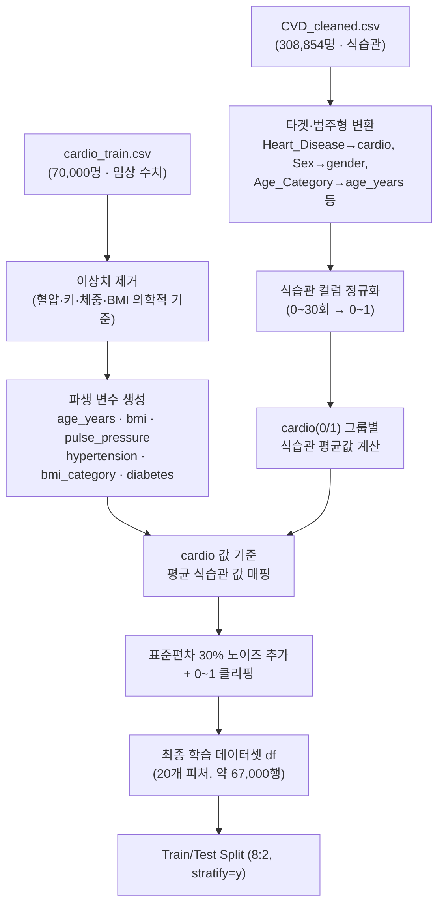
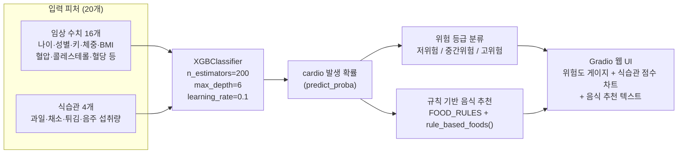

# 🫀 식습관 기반 심혈관 질환 예측 및 맞춤 음식 추천 — 최종 보고서

- 학번: 20201708
- 이름: 김진형

---

## 1. 프로젝트 소개

- 프로젝트명: 식습관 기반 심혈관 질환 예측 및 맞춤 음식 추천 시스템
- 목표
  - 개인의 임상 건강 수치(혈압, 콜레스테롤, BMI 등)와 식습관 데이터(과일·채소·튀김·음주 섭취)를 함께 활용해 심혈관 질환 발생 여부를 예측
  - 예측된 위험 요인에 따라 피해야 할 음식을 안내하는 맞춤형 추천 기능 제공
  - Gradio 기반 웹 UI를 통해 비전문가도 쉽게 위험도를 확인할 수 있도록 구현
- 사용 환경 및 도구
  - Google Colab(노트북 1개, `cardiovascular.ipynb`)
  - Python — pandas, numpy, matplotlib, seaborn, scikit-learn, XGBoost, Gradio
- 주요 산출물
  - XGBoost 기반 심혈관 질환 예측 모델
  - 규칙 기반(rule-based) 음식 추천 엔진(`FOOD_RULES`, `rule_based_foods()`)
  - Gradio 웹 UI(슬라이더 입력 → 위험도 게이지 + 식습관 점수 차트 + 추천 텍스트 출력)

---

## 2. 주제 관련 배경

- 심혈관 질환은 전 세계 사망 원인 1위로, 조기 예측과 예방이 매우 중요한 보건 이슈
- 기존의 심혈관 질환 예측 연구는 대부분 혈압·콜레스테롤·혈당 등 **임상 수치 중심**으로 진행되어, 식습관과 같은 **생활 습관 요인**의 반영이 상대적으로 부족
- 튀긴 음식·고나트륨·고지방 식습관과 채소·과일 섭취 부족이 심혈관 질환 위험과 밀접하게 연관되어 있다는 점에 착안하여, 임상 데이터에 식습관 데이터를 추가로 결합
- 단순히 발병 여부를 예측하는 데 그치지 않고, 예측 결과(위험 요인)에 따라 **개인 맞춤형 식이 추천**까지 제공함으로써 예방 관점의 실용성을 높이는 것을 목표로 설정

---

## 3. 데이터셋 소개

- **cardio_train.csv** (Kaggle, 약 70,000명) — 임상 수치 중심
  - 주요 컬럼: `age`(일 단위), `gender`, `height`, `weight`, `ap_hi`/`ap_lo`(수축기/이완기 혈압), `cholesterol`, `gluc`, `smoke`, `alco`, `active`, `cardio`(타겟: 심혈관 질환 여부)
- **CVD_cleaned.csv** (Kaggle, 약 308,854명) — 식습관·생활 습관 중심
  - 주요 컬럼: `Fruit_Consumption`, `Green_Vegetables_Consumption`, `FriedPotato_Consumption`, `Alcohol_Consumption`(월간 섭취 횟수), `Diabetes`, `Heart_Disease`, `Sex`, `Age_Category`, `Exercise`, `Smoking_History` 등
- 데이터 결합상의 제약
  - 두 데이터셋은 **동일한 환자에 대한 기록이 아니므로** 직접적인 row 단위 병합(join)이 불가능
  - → 통계 기반 매핑 전략을 별도로 설계 (상세 내용은 4장 "전처리 과정" 참고)
- 타겟 변수(`cardio`) 분포
  - 질환 없음: 약 34,608명 (50.5%)
  - 질환 있음: 약 33,892명 (49.5%)
  - 클래스 간 불균형이 거의 없어 별도의 오버샘플링이 불필요한 수준

---

## 4. 전처리 과정

### 4.1 cardio_train 이상치 제거 (의학적 기준 적용)

- `ap_hi`(수축기 혈압): 60 미만 또는 250 초과 제거
- `ap_lo`(이완기 혈압): 40 미만 또는 180 초과 제거
- 수축기 혈압 ≤ 이완기 혈압인 비정상 행 제거
- `height`(키): 140cm 미만 또는 210cm 초과 제거
- `weight`(체중): 30kg 미만 또는 200kg 초과 제거
- `bmi`: 10 미만 또는 60 초과 제거
- 결과: 약 70,000행 → 약 67,000행으로 정제

### 4.2 파생 변수(Feature Engineering) 생성

- `age_years` = `age / 365` (일 단위 → 세 단위 변환)
- `bmi` = `weight / (height/100)²`
- `pulse_pressure`(맥압) = `ap_hi - ap_lo`
- `hypertension`(고혈압 여부) = `ap_hi ≥ 140` 또는 `ap_lo ≥ 90`
- `bmi_category`(BMI 등급) = BMI 구간별 0~3 (저체중/정상/과체중/비만)
- `diabetes`(당뇨 가능성) = `gluc ≥ 2`

### 4.3 CVD_cleaned 식습관 데이터 전처리

- `Heart_Disease`(Yes/No) → `cardio`(1/0) 이진 변환
- `Sex`(Male/Female) → `gender`(2=남성/1=여성) 변환
- `Age_Category`(연령대 구간 문자열, 예: "45-49") → 구간 중간값으로 매핑하여 `age_years` 생성
- `Exercise`/`Smoking_History`/`Diabetes`(Yes/No) → `active`/`smoke`/`diabetes`(1/0) 변환
- 식습관 컬럼(`Fruit_Consumption`, `Green_Vegetables_Consumption`, `FriedPotato_Consumption`, `Alcohol_Consumption`)을 월 0~30회 범위에서 0~1 범위로 정규화 (`/ 30.0`)

### 4.4 두 데이터셋 병합 전략 — 통계 기반 매핑 (직접 join 불가의 대안)

- 두 데이터셋이 동일 환자가 아니므로, 아래와 같은 **통계 기반 매핑 + 노이즈 추가** 방식 채택
  1. CVD_cleaned에서 `cardio`(0/1) 그룹별 식습관 컬럼(과일·채소·튀김·음주)의 평균값 계산
  2. cardio_train의 각 행에 해당 행의 `cardio` 값(0 또는 1)에 대응하는 평균 식습관 값을 매핑
  3. 현실적인 분포를 반영하기 위해 평균에 `표준편차 × 0.3` 수준의 정규분포 노이즈를 추가
  4. 0~1 범위로 클리핑(clip)하여 정규화 범위를 유지
  5. 실제 개인 예측 시에는 사용자가 본인의 식습관 데이터를 직접 입력하여 사용
- 한계: 통계적 평균 기반 매핑이므로 실제 동일 환자의 임상-식습관 결합 데이터에 비해 정밀도에 한계가 있음 (8장 "프로젝트 결과"의 한계점 참고)

### 4.5 데이터 분리

- Train : Test = 8 : 2 비율로 분리
- `stratify=y` 옵션을 사용해 학습/평가 데이터의 클래스(질환 유무) 비율을 동일하게 유지

### 4.6 전처리 & 데이터 결합 파이프라인 구조도

---

## 5. 모델 구조

### 5.1 사용 모델 — XGBoost (XGBClassifier)

- 선택 이유
  - 결측치에 강하고 피처 중요도 해석이 용이
  - 대용량 데이터에서도 빠른 학습 속도
  - 앙상블(Boosting) 기반으로 높은 예측 성능 기대

### 5.2 주요 하이퍼파라미터

- `n_estimators = 200`
- `max_depth = 6`
- `learning_rate = 0.1`
- `random_state = 42`
- `eval_metric = 'logloss'`

### 5.3 입력 피처 — 총 20개

- 임상 수치 16개: `age_years`, `gender`, `height`, `weight`, `bmi`, `ap_hi`, `ap_lo`, `pulse_pressure`, `hypertension`, `cholesterol`, `gluc`, `smoke`, `alco`, `active`, `bmi_category`, `diabetes`
- 식습관 4개(CVD_cleaned에서 추가): `Fruit_Consumption`, `Green_Vegetables_Consumption`, `FriedPotato_Consumption`, `Alcohol_Consumption`

### 5.4 출력 및 후처리 흐름

- 모델 출력: `cardio`(심혈관 질환 발생) 예측 확률(`predict_proba`)
- 확률 → 위험 등급 변환: 고위험(≥60%) / 중간위험(≥40%) / 저위험(그 외)
- 예측된 위험 요인(고혈압, 고콜레스테롤, 고혈당/당뇨, 비만, 튀김 과다, 채소·과일 부족, 흡연, 과음 등)을 기준으로 `FOOD_RULES` 규칙을 매칭해 피해야 할 음식 추천
- 결과를 게이지 차트(위험도) + 바 차트(식습관 점수) + 추천 텍스트 형태로 시각화하여 Gradio UI에 출력

### 5.5 전체 모델 구조도 (입력 → 모델 → 후처리 → UI)

---

## 6. 레퍼런스 개선점

- 기존의 심혈관 질환 예측 자료·선행 사례는 대부분 임상 수치(혈압, 콜레스테롤 등) 단일 데이터셋만을 활용 → 본 프로젝트는 **임상 데이터 + 식습관 데이터**를 함께 결합해 예측 피처를 16개에서 20개로 확장
- 서로 다른 환자 모집단으로 구성된 두 데이터셋을 직접 결합할 수 없는 한계를, 단순 폐기가 아닌 **통계 기반 매핑(클래스별 평균 + 노이즈)** 방식으로 보완하여 활용 가능한 형태로 재구성
- 단순 "예측 확률 출력"에 그치는 기존 사례와 달리, 예측 결과를 바탕으로 한 **규칙 기반 음식 추천 시스템(FOOD_RULES)**을 추가하여 예방 관점의 실질적 정보 제공
- 정적인 분석 결과 보고에서 나아가 **Gradio 기반 인터랙티브 웹 UI**를 구축해, 사용자가 직접 값을 입력하고 즉시 위험도·식습관 점수·추천을 확인할 수 있도록 구현
- 원래 계획했던 Claude AI 기반 맞춤 추천 기능은 API 크레딧 문제로 보류하되, 규칙 기반 추천의 위험 요인 분류를 6개에서 8개로 세분화(튀김 과다, 채소·과일 부족 항목 추가)하여 보완

---

## 7. 프로젝트 결과

### 7.1 모델 성능

| 지표 | 질환 없음 | 질환 있음 | 전체 |
|---|---|---|---|
| 정확도 (Accuracy) | - | - | **0.7464** |
| 정밀도 (Precision) | 0.74 | 0.75 | 0.75 |
| 재현율 (Recall) | 0.77 | 0.72 | 0.75 |
| F1 Score | 0.75 | 0.74 | 0.75 |
| AUC-ROC | - | - | **0.8185** |

- 테스트 샘플 수: 질환 없음 6,922명 / 질환 있음 6,778명 (총 13,700명)
- AUC-ROC 0.8185 → 무작위 예측(0.5) 대비 유의미하게 높은 고위험군 식별 능력 확보
- 질환 없음 재현율(0.77)이 질환 있음 재현율(0.72)보다 높아, 질환이 없는 환자를 더 잘 탐지하는 경향

### 7.2 피처 중요도 (상위 5개)

| 순위 | 피처 | 중요도(약) | 비고 |
|---|---|---|---|
| 1 | 수축기 혈압 (`ap_hi`) | ~0.35 | 임상 수치 |
| 2 | 고혈압 여부 (`hypertension`) | ~0.31 | 파생 변수 |
| 3 | 콜레스테롤 (`cholesterol`) | ~0.08 | 임상 수치 |
| 4 | 나이 (`age_years`) | ~0.05 | 파생 변수 |
| 5 | 음주량 (`Alcohol_Consumption`) | ~0.04 | 식습관(신규 추가) |

- 수축기 혈압 + 고혈압 여부가 전체 중요도의 약 66%를 차지
- 식습관 피처 중 음주량이 상위 5위에 진입 → 식습관 데이터 추가의 효과를 확인

### 7.3 음식 추천 시스템 및 UI 동작 확인

- 8개 위험 요인(고혈압/고콜레스테롤/고혈당·당뇨/비만/튀김 과다/채소·과일 부족/흡연/과음) 기준으로 피해야 할 음식을 규칙 기반으로 매칭
- Gradio UI에서 슬라이더·라디오 버튼으로 개인 정보 및 식습관을 입력 → 위험도 게이지, 식습관 점수 바 차트, 음식 추천 텍스트가 정상적으로 출력되는 것을 확인

### 7.4 한계점

- 두 데이터셋이 동일 환자가 아니므로, 식습관 데이터를 통계적 평균(+ 노이즈)으로 매핑한 한계 존재
- 실제 의료 데이터가 아니므로 임상 적용을 위해서는 전문가 검토가 필요
- 가족력, 스트레스, 수면 등 심혈관 질환에 영향을 줄 수 있는 변수는 미반영

---

## 8. 추후 발전 방향

- K-Fold 교차 검증을 적용해 모델 성능 평가의 신뢰도 향상
- Optuna, GridSearchCV 등을 활용한 하이퍼파라미터 자동 최적화로 성능 추가 개선
- SHAP 라이브러리를 적용해 개별 예측 결과에 대한 해석(설명 가능성) 기능 강화
- API 크레딧 확보 시 Claude AI 기반 맞춤형 식이 추천 기능 복원·고도화 (현재 코드 구조는 복원 가능하도록 유지)
- 동일 환자에 대한 임상 수치 + 식습관 데이터를 함께 보유한 데이터셋을 확보해, 통계적 매핑의 한계를 극복하고 예측 정확도 향상
- 다양한 입력값(혈압 이상값, 극단적 식습관 등)에 대한 엣지 케이스 검증 및 Gradio UI 디자인·사용성 개선

---

*본 보고서는 학습 목적으로 작성되었으며, 의학적 진단을 대체하지 않습니다.*
